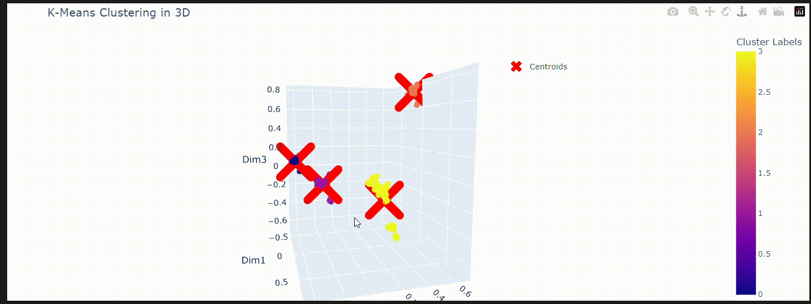

# **Homework 4 - Movie Recommendation System**

The goal of this project is to develop a **Recommender System** that is able to recommend movies based on similar users.

Then we have implemented by scratch three versions of th e **K-Means** algorithm, and determined the optimal number of clusters.

All the data we've worked on was downloaded from this [Kaggle dataset](https://www.kaggle.com/datasets/grouplens/movielens-20m-dataset?select=rating.csv).
___

  

 

____

## **Project Structure**
___
- In this repository you can find:

     

  > __main.ipynb__:
  
     

    
    - A Jupyter Notebook where we gather all the answers and the explanations to the Research and Algorithmic Questions.
 
     
     
  > __functions.py__:
    
     

    - A python script where we have define the functions we have used in the `main.ipynb`
    
     

  > __assets/__:

     

    - Directory where we store our generated Gifs

     

  - In our `main.ipynb` we have also realized an interactive 3D scatter plot using the *Plotly* module *Express*
      
  

  

   

## **Collaborators - Group 13**
- [Marco Zimmatore](https://github.com/zimmy11)
- [Piercarlo Risi](https://github.com/PierSerj)
- [Mattia Visciglio](https://github.com/MattiaV00)
- [Laura Moreno](https://github.com/lamorenod)
